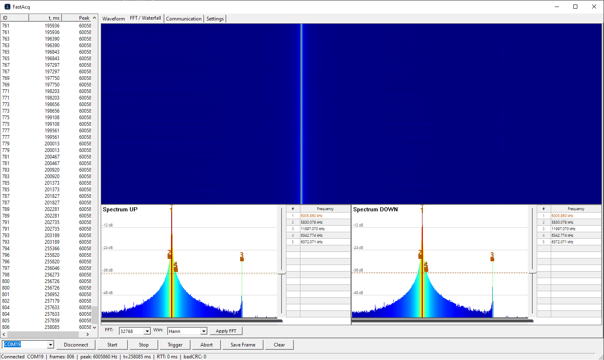
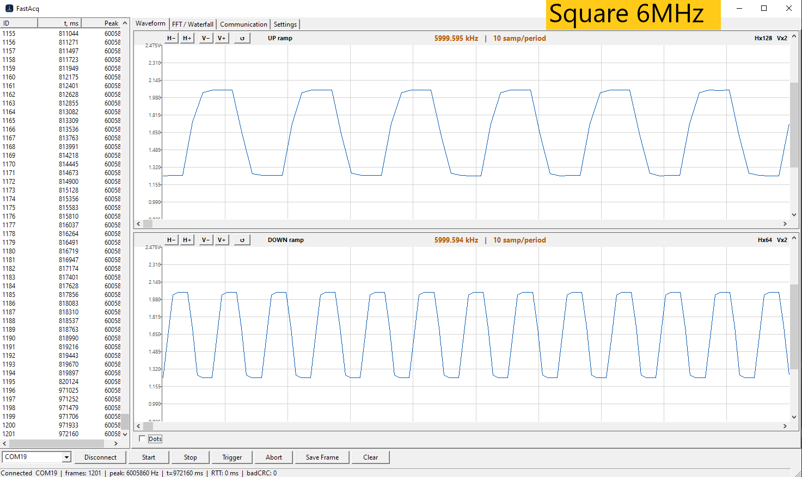
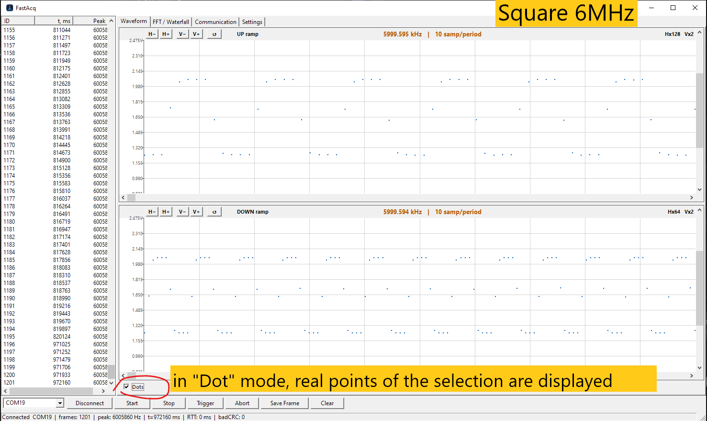
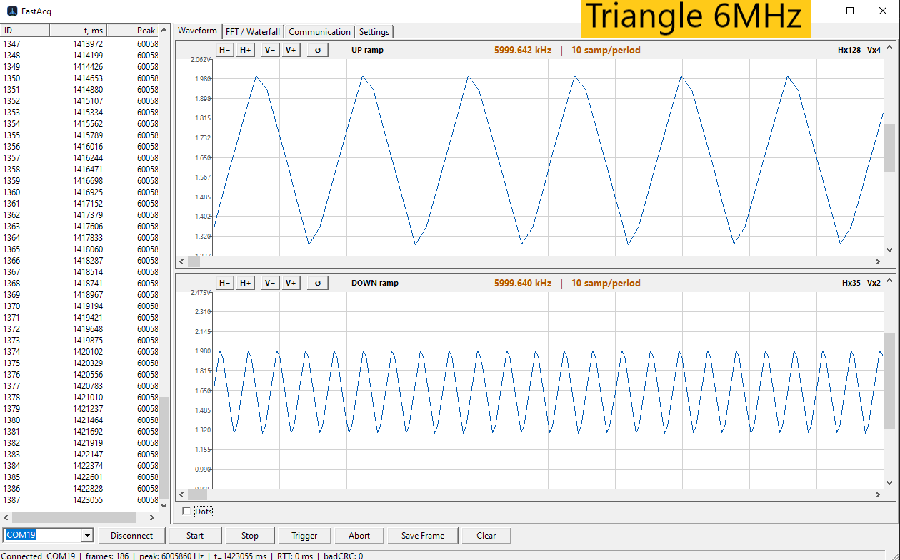
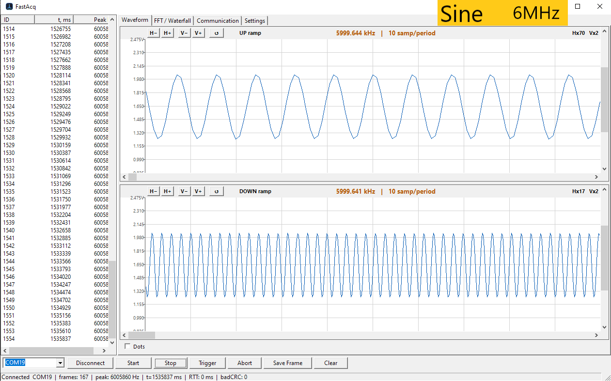
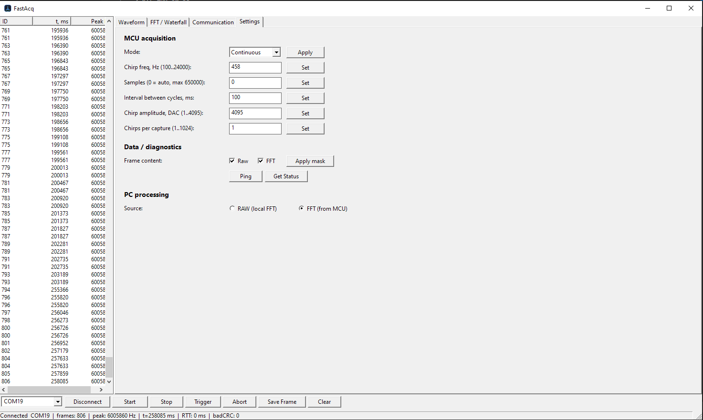

# FastAcqWinApp

A Windows desktop application for **real-time acquisition and analysis of signals** streamed from an **STM32H7 ADC board over USB CDC**. It receives sample frames, runs FFT analysis, and renders live **waveform**, **spectrum** and **waterfall (spectrogram)** views.

Built entirely on **C++ and MFC with GDI rendering, with no third-party libraries**. MFC was chosen deliberately for speed, reliability and self-containment: the result is a single native executable with no runtime dependencies, low latency and predictable real-time performance.

---

## Screenshots

---

## Features

- **Real-time serial acquisition** - a background worker thread reads the USB CDC stream through a binary, CRC-checked protocol without blocking the UI
- **Ring-buffer frame store** - the latest acquisition frames are kept for smooth live display while new data keeps arriving
- **In-house FFT** - Radix-2 (Cooley-Tukey) up to 16384 points, with selectable windows (Rectangular / Hann / Hamming / Blackman)
- **Waveform view** - GDI double-buffered, with zoom and pan (keys, mouse wheel and scrollbars)
- **Spectrum view** - linear or logarithmic magnitude with a cursor readout
- **Waterfall view** - pseudo-color spectrogram
- **On-device or PC-side FFT** - process raw samples locally or use the device result
- **Command panel** - port select, start/stop, set frequency and samples, ping, trigger and mode switch
- **Custom-drawn modern UI** - buttons, tabs and theme on plain MFC, with no UI framework
- **Single native executable** - no third-party dependencies

---

## Tech Stack

| Component | Technology |
|---|---|
| Language | C++17 |
| UI | MFC with GDI double-buffered custom rendering (no third-party UI libs) |
| Acquisition | USB CDC virtual COM, Win32 serial API, binary CRC protocol |
| DSP | In-house Radix-2 Cooley-Tukey FFT, windowing |
| Views | Waveform, spectrum, waterfall (spectrogram) |
| Build | Visual Studio 2022, x64 |
| Dependencies | None (Win32 + MFC only) |

---

## Building

- **Visual Studio 2022** with the **C++ Desktop** workload and **MFC** component
- Open `FastAcq.sln` and build the **x64** configuration, or run `build-and-run.bat`

---

## Paired firmware

This app is the desktop side of a two-part system. The **STM32H7 Fast Acquisition** firmware samples the signal and streams it over USB CDC to this application.

---

## License

This project is licensed under the **MIT License**. See [LICENSE](LICENSE) for details.
