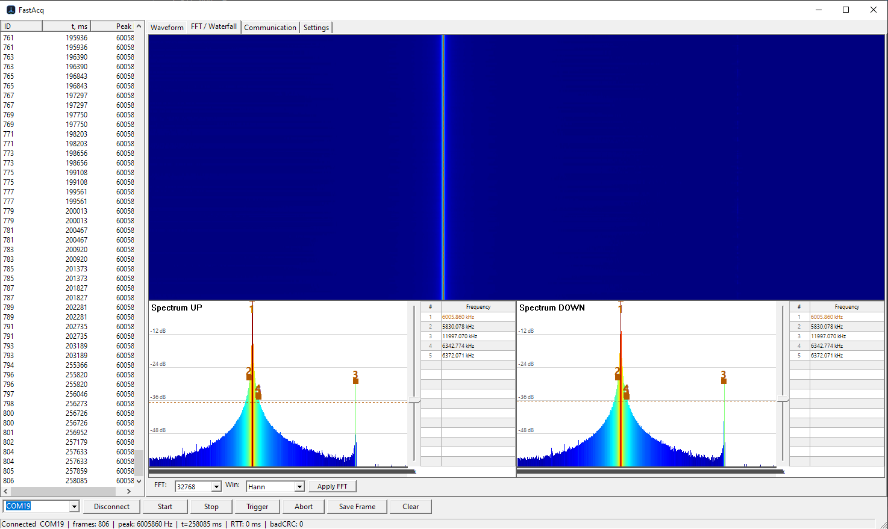
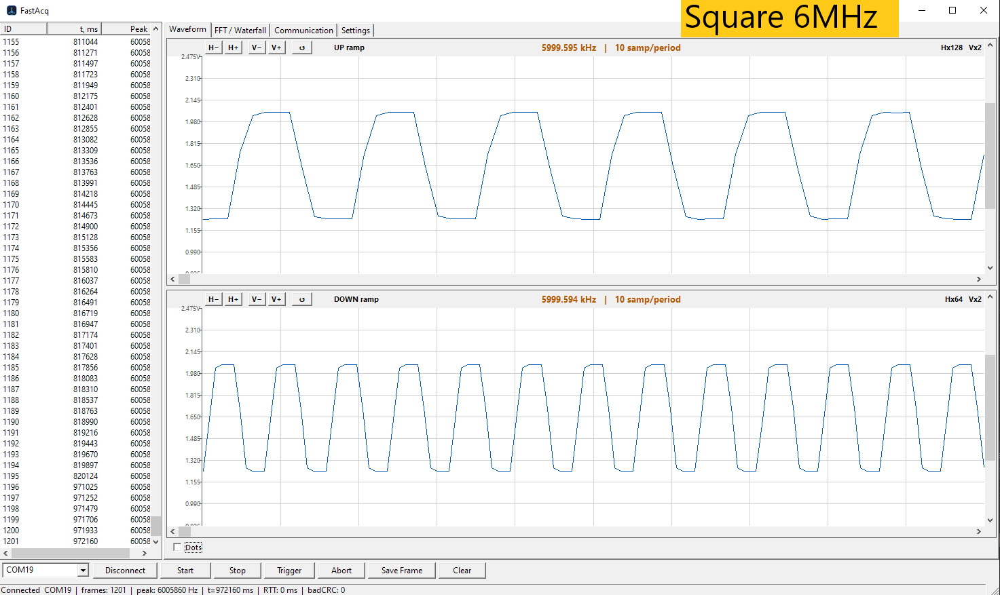
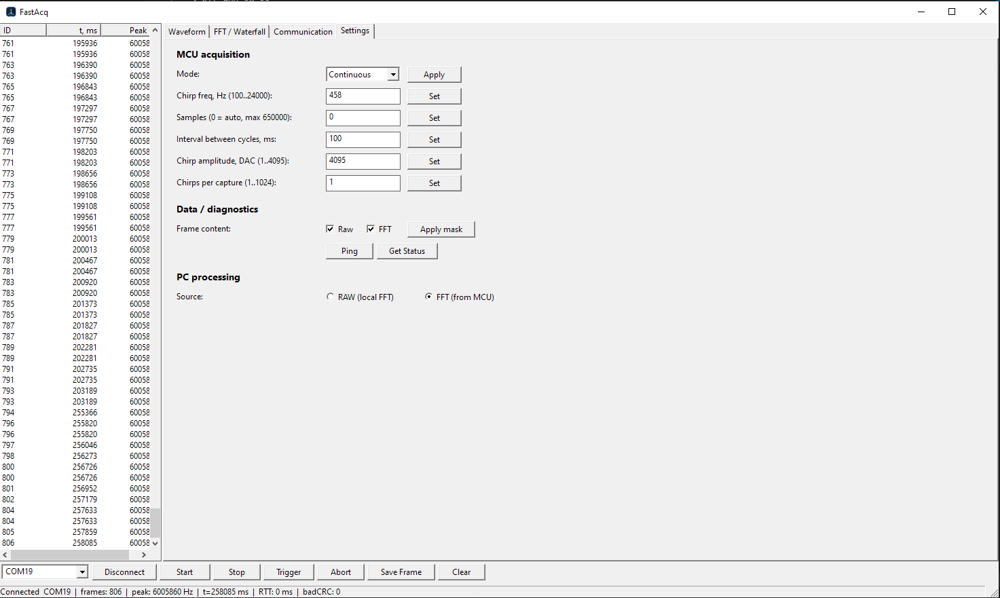

# FastAcqWinApp

A Windows desktop application for **real-time acquisition and analysis of FMCW radar IF (beat) signals** streamed from an **STM32H7 ADC board over USB CDC**. It receives sample frames, runs a full beat-frequency processing chain on the PC and renders live **range profile**, **waterfall (range-time)**, **range-Doppler** and **waveform** views, with a table of detected targets (range, velocity, SNR).

Built entirely on **C++17 and MFC with GDI rendering, with no third-party libraries**: a single native executable, low latency and predictable real-time behaviour.


> The screenshots below show the previous (1.x) interface; the 2.0 layout is described in [docs/ANALYSIS_FMCW.md](docs/ANALYSIS_FMCW.md).

---

## Screenshots







---

## Features

### FMCW processing chain (`FastAcq/Dsp`)
- **Segmentation** of a capture into chirps and UP / DOWN ramps (triangle, sawtooth or single ramp), with configurable **guard** intervals at the ramp edges.
- **Whole-ramp analysis**: every sample of the ramp is used (not just the first N), so the range resolution is the one the swept bandwidth allows.
- **Anti-alias decimation** (Kaiser-designed FIR, automatic factor from the range of interest), mean / **linear-trend removal**, windows **Hann, Hamming, Blackman, Blackman-Harris 4, Kaiser (beta), Flat-top**, zero-padding x1..x8, real FFT with cached plans.
- Absolute **dBFS** scale (0 dB = full-scale sine, window gain compensated), optional range-gain tilt (R^2 / R^4).
- Trace modes **clear write / exponential average / max hold / min hold**.
- Noise-floor estimate and detectors: **noise floor + X dB**, **CA-CFAR**, **OS-CFAR** (guard / training cells, Pfa).
- Peak search with minimum separation and sub-bin interpolation: **parabolic (dB)**, **Jacobsen**, **Candan**, **Quinn**.
- **Range and velocity** from the UP/DOWN pair (`R = c T (f_up + f_dn) / 4B`, `v = lambda (f_dn - f_up) / 4`), zero-range offset, SNR per target, stable target IDs (nearest-neighbour tracking).
- **Range-Doppler map** for burst captures (several chirps per frame), with MTI (mean subtraction).
- **Phase tracking** of the strongest (or chosen) range bin -> sub-millimetre displacement.
- Derived values shown live: range resolution (c/2B and effective), R_max, velocity resolution and ambiguity, bin size, FFT size, USB load.

### Views
- **Radar tab**: range profile (dBFS over frequency + range axis, UP/DOWN traces, threshold, noise, numbered peaks with R/v labels, cursor readout, A/B markers), waterfall (dB, Viridis/Inferno/Turbo/Plasma/Gray/Jet palettes, time axis, colour bar), range-Doppler heat map, target table, trace/palette/visibility footer. Zoom with the wheel at the cursor, Shift+wheel to pan, drag to pan, double-click to reset; the x-range is shared between the profile and the waterfall.
- **Scope tab**: whole frame with UP / DOWN / guard shading and a ramp-detail view, time axis, volts or ADC codes, A/B cursors (dt, 1/dt, dV), dots mode.
- **Communication tab**: virtual-list log with TX / RX / service / error filters, copy, save, optional per-frame lines.
- **Settings tab**: MCU acquisition (mode, chirp frequency, samples, interval, amplitude, burst, data mask), radar geometry (f0, B, ramp time, range offset, modulation shape), processing chain, display, application options.

### Acquisition, recording and replay
- Background serial reader with CRC-checked binary protocol, lost-frame / bad-CRC / bad-header counters and byte-rate statistics.
- Frame ring buffer limited by count **and** bytes; frames are shared between the UI, the DSP thread and the recorder without copies.
- DSP runs on its own thread and always processes the newest frame (no UI lag at high frame rates).
- **Hold / Live**: freeze the display and inspect any buffered frame from the list.
- **Record** the raw stream to a `.facq` session file and **replay** it later (play/pause, step, seek, speed), with the same processing chain - no hardware needed.
- Export: frame as CSV, all buffered targets as CSV, IF signal as WAV, screenshot as PNG, plot image to the clipboard.
- Settings persist in `FastAcq.ini` next to the executable; auto-connect to the FastAcq device at start-up; light and dark theme; per-monitor DPI aware.

### Keyboard
`Space` start/stop, `T` trigger, `H` hold/live, `R` record, `F5` connect, `Ctrl+O` open replay, `Ctrl+S` save frame, `F12` screenshot, `Ctrl+1..4` tabs, `PgUp/PgDn` previous/next frame. In plots: `Esc` clear markers, `Home` reset zoom, `A` autoscale dB.

---

## Architecture

```
COM (USB CDC) -> SerialWorker (thread) -> ProtocolParser -> ChirpStore (shared frames)
                                                               |  WM_APP_FRAME_READY(seq)
                        MainFrame <------------------------------
                           |  Submit(frame)          ^ WM_APP_RESULT_READY(FrameResult)
                        DspWorker (thread) -> dsp::RadarDsp
                           |
   RadarTab (RangeProfileView, WaterfallView, RangeDopplerView, TargetListCtrl)
   ScopeTab (WaveformView x2)   CommLogWnd   SettingsTab   CommandPanel
```

| Directory / file | Content |
|---|---|
| `FastAcq/Dsp/` | Portable DSP: `FftPlan`, `Window`, `Decimator`, `Cfar`, `PeakFinder`, `RadarDsp` (pipeline, pairing, range-Doppler, phase, tracking, derived values) |
| `FastAcq/Core/` | Portable `SessionFile` (.facq writer/reader) and `Export` (WAV, CSV) |
| `FastAcq/ProtocolDefs.h`, `ProtocolParser.*`, `ChirpStore.*` | Portable protocol mirror, frame parser, frame store |
| `FastAcq/*View.*`, `PlotWnd.*` | GDI plots (double-buffered, DPI-scaled, themed) |
| `FastAcq/*Tab.*`, `CommandPanel.*`, `MainFrame*` | UI composition and message routing |
| `tests/` | Unit tests for the portable core (`make test` on Linux/macOS, `FastAcqTests.vcxproj` on Windows) |

The portable parts have no Windows dependency and are compiled and tested on Linux by the CI workflow; the MFC application is built with MSBuild on Windows.

---

## Building

- **Visual Studio 2022** with the **C++ Desktop** workload and **MFC** component.
- Open `FastAcq.sln` and build the **x64** configuration, or run `build-and-run.bat`.
- Unit tests: build and run `FastAcqTests` (Windows) or `make -C tests test` (g++ / clang).
- Syntax check of the MFC sources without Visual Studio: `tests/syntax-check.sh` (needs `mingw-w64`; uses the MFC declaration stubs in `tests/mfcstub`).

## Session file format (`.facq`)

```
SessionFileHeader (96 B): magic "FACQSES1", version, headerSize, createdUnixMs, sampleRateHz, note[64]
repeated records:
  SessionRecordHeader (72 B): magic 'FACR', rawBytes, fftBytes, rxTickMs, FrameHeader (56 B, as sent by the MCU)
  raw[rawBytes]  uint16 LE samples
  fft[fftBytes]  float32 LE magnitudes (optional)
```

Files can be read with a few lines of Python/NumPy; truncated files are handled (the index stops at the last complete record).

---

## Paired firmware

This app is the desktop side of a two-part system. The **STM32H7 Fast Acquisition** firmware samples the signal and streams it over USB CDC to this application. Suggested firmware improvements that would raise the frame rate over USB Full-Speed (12-bit sample packing, on-MCU decimation, extended frame header) are listed in [docs/ANALYSIS_FMCW.md](docs/ANALYSIS_FMCW.md), section 4.6.

---

## License

This project is licensed under the **MIT License**. See [LICENSE](LICENSE) for details.
